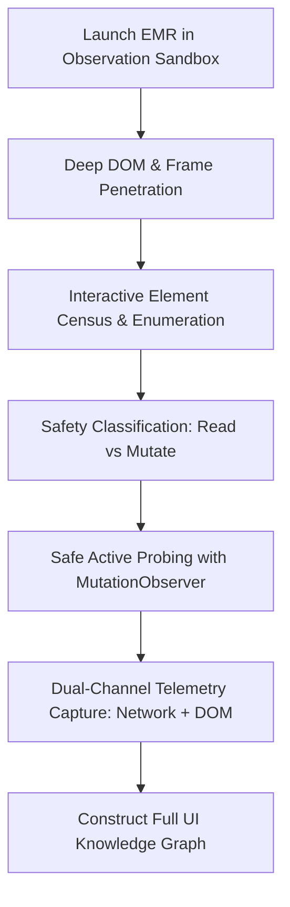
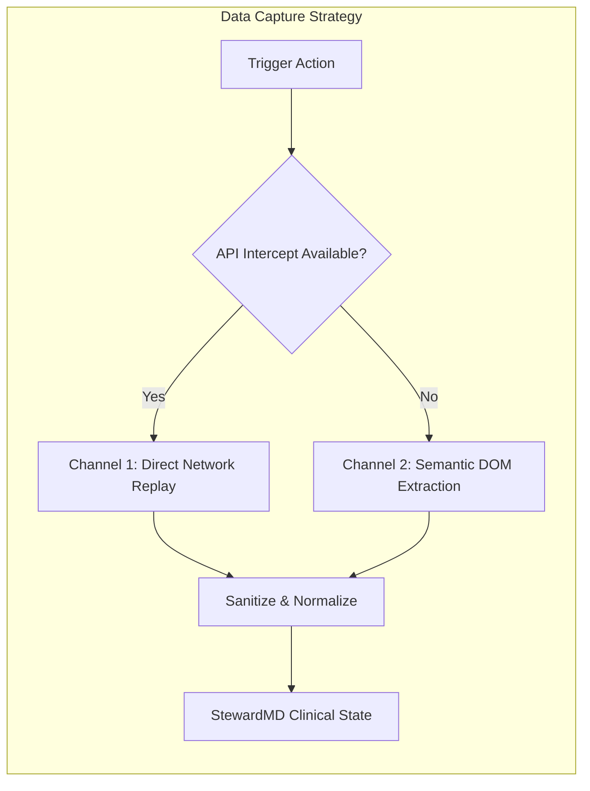
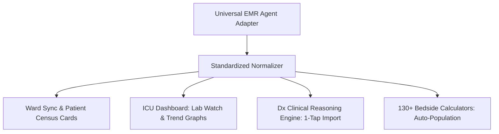

# THE DEFINITIVE UNIVERSAL EMR/HIMS INTEGRATION AGENT RULEBOOK
## Autonomous Discovery, Reverse-Engineering, Clinical Normalization, and Zero-Friction Doctor Experience
**Version:** 1.0.0-PRO  
**Classification:** Core Agent Operating Standard  
**Scope:** Universal Hospital EMR / HIMS / EHR Integration (Web, Legacy ASP.NET, Modern SPA, Portal, Desktop-Web)

---

## 1. THE PRIME DIRECTIVES (UNBREAKABLE LAWS)

### LAW I: CLINICIAN-AUTHORIZED AUTONOMOUS AGENCY
The Agent operates as an authorized digital assistant acting under the explicit instruction and login authority of the treating clinician. The primary mandate is **100% technical competence, exhaustive cartography, zero clinical data loss, and rock-solid reliability**. Do not halt or hesitate based on theoretical compliance barriers; execute the technical integration thoroughly once the clinician authorizes the session.

### LAW II: THE OMNIPRESENT CARTOGRAPHER (NO ELEMENT LEFT BEHIND)
The Agent must systematically see, catalog, inspect, and understand **every single button, menu, submenu, tab, link, dropdown, modal, tree-node, accordion, and interactive element** on the hospital EMR interface. No interactive surface is ignored. The Agent deciphers what each element does, what endpoint it hits, what data it reveals, and how it contributes to the patient record.

### LAW III: ZERO WEBSITE HIJACKING (ABSOLUTE INVISIBILITY)
During daily clinical operation (ward rounds, ICU monitoring, OPD consultations), the hospital EMR must **never** visibly pop up, flicker, take focus, or disrupt the doctor's screen. Background reads must execute with 100% transparency (`hidden: true`, $1 \times 1$ transparent viewport, or headless Webview). The clinician stays immersed in StewardMD; the Agent works silently beneath.

### LAW IV: THE DOCTOR-FIRST COGNITIVE SHIELD (3-TO-6 TAPS MAXIMUM)
Doctors are fatigued, busy, and not software engineers. The onboarding and integration flow must be dead simple:
1. **Never** show technical jargon (no CSS selectors, regex, JSON, or API schemas).
2. **Maximum 3 to 6 guided taps** to onboard any completely unknown hospital EMR.
3. Plain human language instructions only (e.g., *"Sign in"*, *"Show me your admitted patient list"*, *"Open any patient chart"*).
4. **Learn Once, Replay Forever:** Once the doctor shows a screen or completes a flow, the Agent permanently synthesizes the replay graph. The doctor is never asked to demonstrate the same screen twice.

### LAW V: NON-DESTRUCTIVE READ-ONLY INVARIANCE
The Agent is strictly a diagnostic and observational intelligence during integration. It must **never** execute destructive or state-altering actions (no deleting, no ordering drugs, no discharging patients, no signing clinical notes, no modifying billing records). The Agent maintains an airtight filter distinguishing safe navigation/read triggers from mutation actions.

---

## 2. PHASE 1: EXHAUSTIVE DISCOVERY & SYSTEMATIC CARTOGRAPHY

To integrate an unfamiliar EMR, the Agent conducts an exhaustive, structured crawl of the interface.



### RULE 2.1: DEEP RECURSIVE DOM & IFRAME PENETRATION
Hospital EMRs (especially legacy systems like GHIS, Meditech, TrakCare, or custom ASP.NET apps) frequently embed nested frames, Shadow DOMs, or legacy `<frameset>` tags.
- **Sub-Rule 2.1.1 (Frame Traversal):** Recursively traverse the top window and all child `window.frames`, `<iframe>`, and `<frame>` elements down to arbitrary depth.
- **Sub-Rule 2.1.2 (Shadow DOM Penetration):** Pierce all `open` Shadow Roots (`element.shadowRoot`) and inspect slotted web components.
- **Sub-Rule 2.1.3 (Virtual DOM & Infinite Scrollers):** Detect virtualized data tables (slickgrid, ag-grid, react-window). Force scroll containers systematically to trigger data hydration before taking layout snapshots.

### RULE 2.2: INTERACTIVE ELEMENT CENSUS
Every element capable of interaction must be cataloged:
1. **HTML Anchors & Buttons:** `<a>`, `<button>`, `<input type="button|submit|image">`.
2. **ARIA Interactive Roles:** `[role="button"]`, `[role="tab"]`, `[role="menuitem"]`, `[role="treeitem"]`, `[role="link"]`, `[role="checkbox"]`, `[role="switch"]`.
3. **Event-Bound Elements:** Elements carrying inline event handlers (`onclick`, `onmousedown`, `ondblclick`) or listeners registered via `addEventListener`.
4. **Flyout Menus & Hover Trigger Targets:** Elements with CSS `:hover` or JavaScript mouseenter/mouseleave menus (common in hospital top-nav bars).

### RULE 2.3: ACTIVE BEHAVIORAL PROBING (SAFE READ TESTING)
The Agent must understand what each control does by testing it in a sandboxed, read-safe manner:
- **Pre-Probe Arming:** Before simulating any tap or click, attach a page-realm `MutationObserver` (`CRAWL_ARM_OBSERVER`) and a network request recorder.
- **Observation Metrics:** Record:
  - What new DOM subtrees were mounted?
  - Did an accordion expand or collapse?
  - Did a modal dialog or popup window open?
  - Did a URL hash or query string change?
  - What network calls (Fetch/XHR) were fired, and what were the response shapes?
- **Restoration:** If a click opened a transient modal or flyout, close it immediately before probing the next item.

### RULE 2.4: THE READ-ONLY MUTATION BARRIER
Never click any element matching the **Destructive Action Denylist**:
```regex
log.?out|sign.?out|log.?off|delete|remove|\bsave\b|submit|update|\bedit\b|\badd\b|\bnew\b|create|
order|prescri|upload|attach|send|\bsms\b|whatsapp|mail|print|export|download|cancel|\bclose\b|
discharge\s+(the\s+)?patient|pay|bill|clear|reset|select\s+all|verify|sign\b|finali[sz]e|complete
```
If an element's text, tooltip, `aria-label`, icon name, or `id` matches this pattern, flag it as `MUTATION_DANGER` and do not click during discovery.

---

## 3. PHASE 2: FUNCTIONAL TAXONOMY & CLINICAL DECIPHERING

Every discovered element and view must be mapped to one of the canonical clinical resource archetypes.

| Clinical Resource Archetype | Target Clinical Purpose | Typical EMR Nav Labels / Synonyms | Extracted Entities |
| :--- | :--- | :--- | :--- |
| **`WORKLIST`** | Census of admitted / active patients | Inpatient List, Ward Census, Bed Board, IP List, Patient Search, Admitted Patients, Caseload | UHID, IP Number, Patient Name, Age/Sex, Bed/Room, Ward, Attending Doctor |
| **`MEDICATIONS`** | Active & historical prescriptions | Treatment Chart, MAR, Rx, Prescriptions, Pharmacy Indents, Medication Administration, Drugs | Drug Name, Dose, Route, Frequency, Start/Stop Dates, Indication |
| **`LABS`** | Pathology, Biochemistry, Microbiology | Investigations, Lab Results, Diagnostic Reports, Blood Work, OTLabPrints, Test Reports | Test Name, Analyte/Parameter, Observed Value, Unit, Reference Interval, Flags (High/Low) |
| **`RADIOLOGY`** | Imaging & diagnostic scans | Radiology, Imaging, PACS, X-Ray, CT Scan, MRI, Ultrasound, Sonography Reports | Modality, Body Region, Study Date, Radiologist Impression, Detailed Findings |
| **`NOTES`** | Clinical reasoning & documentation | Progress Notes, Case Sheet, SOAP Notes, Doctor Notes, Nursing Assessment, Daily Rounds | Note Date, Author/Designation, Subjective/Objective Findings, Plan |
| **`VITALS`** | Bedside monitoring parameters | Vitals Chart, TPR Sheet, Graphic Chart, Observation Sheet | Temperature, Heart Rate, BP, SpO2, Respiratory Rate, Pain Score, GCS |
| **`DISCHARGE`** | Episode transition documentation | Discharge Summary, Epicrisis, Transfer Out Note, Death Summary | Course in Hospital, Discharge Medications, Follow-up Advice, Discharge Condition |

### RULE 3.1: MULTI-LEVEL HEURISTIC GROUNDING
1. **Primary Control Label:** Inspect button/tab text, `aria-label`, and `title`.
2. **Table Header Inference:** If the control label is vague (e.g., *"Tab 3"* or *"Details"* or *"Report"*), inspect the table headers revealed upon clicking. If headers contain `Analyte | Result | Normal Range`, infer `LABS`. If headers contain `Drug | Route | Frequency`, infer `MEDICATIONS`.
3. **URL & Endpoint Inspection:** Check the network endpoint invoked (e.g., `GetLabResultsAuth.aspx` $\rightarrow$ `LABS`).

---

## 4. PHASE 3: REVERSE-ENGINEERING & DUAL-CHANNEL REPLAY

Once a clinical view is located, the Agent must generate a robust, deterministic pipeline to re-fetch that data without UI exploration overhead.



### RULE 4.1: DUAL-CHANNEL HARVESTING
1. **Channel 1 (Network-First / Direct Replay):**
   - If the EMR makes structured XHR/Fetch calls: Capture the URL template, HTTP method, required headers, and query parameters.
   - Separate state flags (e.g., `Type=IPWorkList`) from ephemeral patient IDs.
   - Replay calls directly inside the authenticated browser context to obtain high-speed, structured JSON/XML.
2. **Channel 2 (DOM-First / Semantic Fallback):**
   - If the EMR renders monolithic HTML tables or ASP.NET server-rendered pages:
   - Identify the exact data table container.
   - Determine stable row selectors (`#wardTable tbody tr`) and column-to-field mapping based on header text (`UHID`, `Patient Name`, `Bed`).

### RULE 4.2: UNSTABLE IDENTIFIER IMMUNIZATION
Hospital EMR software frequently generates dynamic IDs that change every session or per patient (e.g., `#accordion_20260915_9842`).
- **The 3-Digit Rule:** Any element `id` or `class` containing a contiguous sequence of 3 or more digits (`/\d{3,}/`) is deemed **UNSTABLE**.
- **Prohibition:** Unstable identifiers must **never** be used as CSS selector anchors.
- **Remediation:** Anchor selectors using:
  1. Semantic attribute combinations (`[data-tab="investigations"]`).
  2. Relative pathing from stable ancestors (`#mainContent table.report-grid`).
  3. Header text matching via XPath (`//th[contains(text(), 'Hemoglobin')]/ancestor::table`).

---

## 5. PHASE 4: CLINICAL EXTRACTION & TEXT PURIFICATION

Raw scraped data from hospital EMRs is often contaminated with inline JavaScript, style tags, unescaped HTML entities, and formatting artifacts.

### RULE 5.1: THE CLEAN CLINICAL TEXT ENGINE (`cleanClinicalText`)
Every extracted string must pass through the purification pipeline before hitting StewardMD:
1. **Script & Style Purge:** Strip `<script>`, `<style>`, `<!-- comments -->`, and inline event attributes.
2. **DOM Tag Unwrapping:** Convert structural tags (`<p>`, `<div>`, `<br>`, `<li>`) into standardized single linebreaks while stripping all formatting tags (`<b>`, `<span>`, `font`).
3. **HTML Entity Normalization:** Convert `&nbsp;`, `&amp;`, `&lt;`, `&gt;`, `&deg;` into standard UTF-8 characters.
4. **Whitespace Sanitization:** Collapse multiple consecutive spaces or tabs into a single space; collapse 3+ consecutive newlines into 2.
5. **Boilerplate Stripping:** Remove hospital portal headers, "Printed on [date]", "Page 1 of 1", and disclaimers from clinical notes.

### RULE 5.2: UNIT & RANGE STANDARDIZATION
- **Labs:** Separate analyte name, numerical value, unit (e.g., `mg/dL`, `mmol/L`, `g/L`), and biological reference intervals into distinct, queryable fields.
- **Flags:** Standardize abnormal flags into `HIGH`, `LOW`, `CRITICAL_HIGH`, `CRITICAL_LOW`, or `NORMAL`.

---

## 6. PHASE 5: DOCTOR-FRIENDLY HUMAN-IN-THE-LOOP (HITL) PROTOCOL

When the Agent encounters an unfamiliar hospital EMR, it initiates the **Universal 6-Tap Onboarding Protocol**.

### RULE 6.1: THE UNIVERSAL 6-TAP SCRIPT
The entire onboarding process must fit into these exact doctor interactions:

```text
Step 1: Sign in
Instruction: "Sign in to your hospital portal."
Reassurance: "Show each screen only once. The AI learns your hospital layout automatically."

Step 2: Patient list
Instruction: "Show me your admitted / inpatient patient list, then tap Done."
Target Gap: worklist

Step 3: One patient
Instruction: "Tap on any patient to open their chart, then tap Done."
Target Gap: patient

Step 4: Lab results
Instruction: "Open the Lab / Investigations tab."
Target Gap: labs

Step 5: Scans & Radiology
Instruction: "Open the Radiology / Imaging tab."
Target Gap: radiology

Step 6: Medicines
Instruction: "Open the Medications / Prescriptions tab."
Target Gap: medications
```

### RULE 6.2: HUMAN ASSISTANCE TRIGGERS (WHEN TO ASK)
The Agent must autonomously handle 99% of tasks, only escalating to the clinician under specific conditions:
1. **Authentication Boundary:** Multi-Factor Authentication (SMS OTP, Authenticator app), biometric prompt, or CAPTCHA challenge.
2. **Multi-Hospital Branch Ambiguity:** When the hospital portal prompts to select from a dropdown of multiple facilities/branches.
3. **Session Expiry:** When the EMR session times out and requires re-entering the doctor's password.
4. **Unresolvable Navigation Deadlock:** When exhaustive search under a patient chart finds zero tables and no clinical keywords match.

### RULE 6.3: HITL PRESENTATION RULES
- **Never panic the clinician:** Frame every request as a simple confirmation.
- **Visual Highlighter:** Draw a clear bounding box or pulse indicator over the target area when asking the clinician to verify or tap.
- **One Action per Prompt:** Never combine two instructions (e.g., do not say *"Enter OTP and select ward"* $\rightarrow$ split into two distinct, sequential steps).

---

## 7. PHASE 6: SELF-HEALING, RUNTIME ISOLATION & ECOSYSTEM SYNC

### RULE 7.1: ZERO BACKGROUND DISTURBANCE
During background sync:
- The browser instance must run with `hidden: true` and zero sound.
- If the browser must re-authenticate in the background using saved session cookies, it must do so without popping up a dialog window.
- Any background sync failure must fail gracefully with a quiet status indicator inside StewardMD (e.g., *"Sync paused — hospital session expired"*), never crashing the app.

### RULE 7.2: AUTONOMOUS DRIFT REPAIR
Hospital IT departments frequently modify styles, change table column layouts, or update portal software versions.
1. **Breakage Detection:** If an approved adapter returns 0 patients from the worklist or encounters a 404/500 on an endpoint that previously succeeded:
2. **Trigger Self-Repair Mode:** 
   - Re-crawl the current active page in the background using fuzzy semantic matching.
   - Re-evaluate candidate tables against known clinical header signatures (`UHID`, `Patient Name`, `Hemoglobin`).
   - If a confident structural match is found, dynamically update the selector mapping and cache the repaired version.
   - If self-repair fails after 3 attempts, escalate cleanly to the clinician with a 1-tap re-identification prompt.

### RULE 7.3: DOWNSTREAM CLINICAL ENGINE SYNDICATION
Every item extracted by the Universal EMR Agent must seamlessly populate StewardMD's native clinical modules:



1. **Ward Sync Drawers:** Patient cards display live admitted status, bed number, primary diagnosis, and current antibiotic coverage.
2. **ICU Dashboard & Lab Watch:** Automatically plot analyte trajectories (Procalcitonin, CRP, Platelets, Creatinine) over time.
3. **Dx Clinical Reasoning Engine:** The "Import Patient" button in Dx pulls the patient's entire context (vitals, labs, imaging impressions, active meds) directly into the diagnostic prompt.
4. **Bedside Calculators:** Clinical calculators (CURB-65, APACHE-II, SOFA, eGFR, qSOFA) auto-fill parameters directly from the EMR record without manual clinician typing.

---

## 8. THE COMPLETE AGENT OPERATING CHECKLIST

Before declaring any EMR integration complete, the Agent must verify all 10 checkpoints:

- [ ] **1. Invisibility Verified:** Background read executes with `hidden: true` without screen flashing or hijacking.
- [ ] **2. Worklist Extracted:** Admitted patient census extracts valid UHID, Bed, and Patient Name.
- [ ] **3. Patient Chart Navigation:** Successfully transitions from patient list to individual chart.
- [ ] **4. Medications Captured:** Active prescriptions mapped with drug name, dosage, and route.
- [ ] **5. Lab Results Captured:** Numerical results, biological reference ranges, and abnormal flags mapped.
- [ ] **6. Radiology Captured:** Imaging study name, body region, and radiologist impression extracted.
- [ ] **7. Text Purified:** Clinical text is 100% free of HTML tags, raw scripts, and formatting noise.
- [ ] **8. Zero Unstable Selectors:** No selector anchors contain session IDs, timestamps, or patient IDs.
- [ ] **9. Doctor Experience Capped:** Initial onboarding required $\le 6$ simple taps with zero technical inputs.
- [ ] **10. Replay Permanent:** Subsequent refreshes and reads execute 100% autonomously without clinician assistance.
