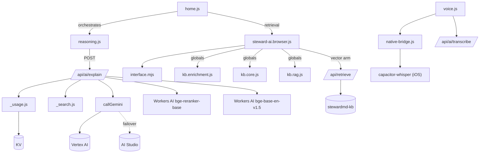

# StewardMD MaiK — Complete Architecture Audit & Redesign

*Principal-architect review of the production medical AI assistant. Read-only reverse-engineering; no code was changed to produce this. Branch `main` @ 7d074e27, 2026-07-27.*

Method: the AI endpoint (`functions/api/ai/[[path]].js`, 990 lines) was read in full first-hand; five parallel deep-dives then mapped the client RAG/flow, the knowledge base, the voice pipeline, the server support layer, and auth/infra/deployment. Findings are cross-verified and cited `file:line`.

---

## 0. Executive summary

**What MaiK is:** a *grounded explainer*, not a free-diagnosing chatbot. A deterministic rule engine computes the diagnosis; `gemini-2.5-flash` (Vertex AI, keyless WIF, AI-Studio failover) only explains it, answers grounded general-knowledge questions, extracts structured fields from images/voice, or does opt-in web research. Retrieval is **hybrid** (client TF-IDF lexical + a server Cloudflare Vectorize dense arm fused by RRF), the engine owns the diagnosis, and there is a real (but disabled) embeddings-based hallucination check. **This is a genuinely above-average, safety-conscious design** — better than the naive "stuff docs into a prompt" RAG most teams ship.

**The five things that most limit it today:**

| # | Finding | Where | Severity |
|---|---------|-------|----------|
| 1 | **The AI proxy is Origin-gated, not authenticated** — an empty `Origin` passes, so the LLM is a near-open, IP-metered proxy; the *only* global cost guard is one daily ₹1000 circuit breaker on a **shared** bucket with non-atomic KV counters that under-fire | `[[path]].js:47-49`, `_usage.js:111-124` | **Critical** |
| 2 | **The typed chat question is NOT PHI-redacted** — `redactPHI` runs only on OCR/vision text, so "my patient Ramesh, MRN 4471…" goes verbatim to Gemini/Vertex (and TinyFish on research) | `reasoning.js:3651`, `home.js:2837` | **Critical** |
| 3 | **The vector index is 90% empty and stale** — only 487 of 5,055 disease docs are embedded, disease-level not chunk-level, refreshed by a manual GitHub Action | `kb.disease-vectors.ndjson`, `embed-kb.yml` | **High** |
| 4 | **The hallucination verifier exists but is turned off** (`MAIK_VERIFY` default off), and citations are over-bucketed client-side so a prose `[n]` may not map to a distinct source | `[[path]].js:432-451`, `reasoning.js:4234` | **High** |
| 5 | **Voice is fragmented & partly mislabeled** — 4 STT backends, on-device Whisper iOS-only with a `TODO` model host, no VAD/wake/barge-in, Web Speech mislabeled "on-device" while Chrome ships audio to Google; consent gate misses `/transcribe` + `/extract` | `voice.js`, `native-bridge.js:41`, `privacy.js:139-146` | **High** |

**The single highest-leverage upgrade:** finish and turn on the retrieval + grounding-verification loop (embed the whole corpus at chunk level, auto-refresh, enable `MAIK_VERIFY`, fix citation mapping). That is what moves MaiK from "good explainer" to "OpenEvidence-grade, citation-faithful medical AI" — and most of the machinery is already written.

---

## Phase 2 — Current architecture

### 2.1 System topology (hero diagram)

```
                                 ┌─────────────────────────────────────────────┐
   ┌──────────────┐              │  Cloudflare Pages  (stewardmd.in)            │
   │  Native app  │  /api/*      │                                             │
   │ (Capacitor 8)│─────────────▶│  functions/_middleware.js  (coming-soon gate)│
   │  WKWebView   │  CapacitorHttp│  functions/api/ai/[[path]].js  ◀── AI brain │
   └──────┬───────┘   (no stream) │  functions/api/retrieve/…     (vector arm)  │
          │                       │  functions/api/verify-doctor, auth/*, …      │
   ┌──────┴───────┐   same-origin │  bindings: AI(WorkersAI) · KB_VECTORIZE ·   │
   │  Web browser │──────────────▶│  D1(nmc,updates) · KV(MAIK/GHIS/UPDATES) ·  │
   │  (SSE stream)│               │  Firebase(verify) · Vertex/Gemini · Resend  │
   └──────┬───────┘               └───────────┬──────────────────┬────────────┘
          │                                   │                  │
          │ client-side RAG                   │ generateContent  │ query()
          ▼                                   ▼                  ▼
   ┌─────────────────────────┐    ┌────────────────────┐  ┌──────────────────┐
   │ kb/ai/steward-ai.browser│    │  Google Vertex AI  │  │ Vectorize        │
   │  TF-IDF over runtime     │    │  gemini-2.5-flash  │  │ "stewardmd-kb"   │
   │  chunks (kb.enrichment,  │    │  (WIF keyless)     │  │ bge-768, 487 vec │
   │  kb.core, kb.rag …)      │    └────────────────────┘  └──────────────────┘
   └─────────────────────────┘
   ┌──────────────────────────────────────────────────────────────────────────┐
   │ Cloudflare Worker api.stewardmd.in (drug DB, OTA, cron)  ·  Firebase Auth  │
   │ + Firestore (cases/ICU/shared PHI)  ·  Cloud Run: kardiox/thorex (ECG/CXR) │
   └──────────────────────────────────────────────────────────────────────────┘
```

### 2.2 Request flow (the canonical "ask MaiK a clinical question")

```mermaid
sequenceDiagram
  participant U as Clinician
  participant H as home.js (Aurora UI)
  participant R as kb/ai (StewardRAG)
  participant V as reasoning.js (SMD_AI)
  participant F as /api/ai/explain
  participant Q as _usage.js (quota)
  participant X as /api/retrieve (Vectorize)
  participant G as Gemini 2.5 Flash

  U->>H: type / dictate question
  H->>H: maikResolveFollowup() → maikRoute() (regex intent)
  Note over H: casual/help/patient/clarify → answered locally, ₹0
  H->>R: buildPackage(assess(findings), {question})
  R->>R: TF-IDF lexical retrieve (TOP_N=5, RETRIEVE_K=8)
  opt lexical top-hit not name-sure & smd_hybrid ON
    R->>X: POST {query,k}
    X->>X: bge-base-en-v1.5 embed → Vectorize.query
    X-->>R: diseaseIds ; RRF fuse (K=60)
  end
  R-->>H: grounded package (engine dx + chunks + treatment + sources)
  H->>H: topicMatch tier → CONFIDENT | ASSUME | NONE(→web research)
  H->>V: explainGroundedStream(pkg) [web] / explainGrounded(pkg) [native]
  V->>F: POST /api/ai/explain (?stream=1 web)
  F->>Q: checkQuota(case|general)
  Q-->>F: ok / 402 needsPro / 429
  F->>F: rerankRetrieved() cross-encoder (bge-reranker-base)
  F->>F: renderGroundedPrompt() → system prompt + evidence
  F->>G: generateContent (temp 0.25/0.45, out 600/1100, thinkingBudget:0)
  G-->>F: answer text
  F-->>V: {text, mode, citations}  (or SSE delta+done)
  V-->>H: text
  H->>H: maikRenderAnswer() → markdown, [n] cites, refine chips, sources
  U-->>H: (optional) tap refine chip / web-research / Rx
```

**Key architectural facts (all confirmed in code):**

- **Retrieval is client-side.** The browser/app assembles the grounded `package` and POSTs it; the whole KB never transits. Server adds only rerank + prompt + Gemini.
- **Streaming is effectively off.** `MAIK_LIVE_STREAM` defaults off because upstream SSE was delivering empty bodies and hanging; the server generates the whole answer and replays it as one SSE `delta+done` (`[[path]].js:724-734, 104-114`). Native (CapacitorHttp) can't stream at all → tighter 600-token cap to finish faster.
- **The engine owns the diagnosis.** Every system prompt tells Gemini the differential is authoritative and not to change it (`[[path]].js:308-324`).

### 2.3 Dependency graph (who calls what)



---

## Phase 3 — Component catalog

Concise per-module summary (full per-function tables are in §Phase 4–9). Format: *purpose · in→out · deps · main weakness · latency*.

| Module (file) | Purpose | In → Out | Deps | Main weakness | Latency |
|---|---|---|---|---|---|
| `functions/api/ai/[[path]].js` | AI brain: 12 routes | package/image/audio → text/JSON | Vertex, WorkersAI, `_usage`, `_search` | Origin-only auth; live-stream off | 1 Gemini RT (~1–4 s) |
| `reasoning.js` `SMD_AI` | Network client + SSE parser + renderers | pkg → rendered md | fetch/CapacitorHttp, Firebase | native = no token (guest); hand-rolled SSE | +watchdogs |
| `home.js` MaiK | Aurora UI, intent router, memory | text → DOM | reasoning.js, StewardRAG | regex-only intent; PHI question unredacted | ~0 local |
| `kb/ai/steward-ai.browser.js` | Client RAG, package build | assess → pkg | interface.mjs, KB globals, /api/retrieve | disease-level vector; runtime chunking dup | KB load + 0.7–3 s vector |
| `kb/ai/interface.mjs` | TF-IDF + RRF | query → ranked chunks | precomputed bags | pure lexical primary; no stemming | O(N) in JS |
| `functions/api/retrieve/[[path]].js` | Dense vector arm | query → diseaseIds | WorkersAI bge-768, Vectorize | 90% corpus unembedded; disease-level | embed + query |
| `functions/_usage.js` | Quota, metering, breaker | request → gate | MAIK_KV | non-atomic counters; fail-open no-KV | 3–6 KV ops |
| `functions/_entitlement.js` | Pro gate | token → `{pro:true}` | Firebase | **hard-wired Pro=true (bypassed)** | 1 verify |
| `functions/_search.js` | TinyFish web search | query → 8 results | TINYFISH_API_KEY | **no timeout**; PHI egress | 1 fetch |
| `voice.js` `SMD_VOICE` | STT engine selection + Scribe UI | mic → transcript → fields | native-bridge, SMD_AI | no VAD/wake; mislabels | 1–7 s STT |
| `native-bridge.js` | Native STT + Whisper + routing | — | Capacitor plugins | Whisper model host `TODO`; iOS-only | — |
| `functions/api/verify-doctor.js` | Doctor verification | cert image → `verified` claim | Gemini OCR, NMC, D1, KV | **PII in logs**; Gemini key in URL | NMC ≤8 s |
| `functions/_middleware.js` | Coming-soon access gate | request → gate/pass | — | shareable `/realapp` path knock | ~0 |

---

## Phase 4 — RAG audit

| Dimension | What exists | Verdict |
|---|---|---|
| **Doc storage** | Per-disease JSON under `kb/` (144 diagnostic + 4,664 reference + 142 treatment + 8 policy). Compiled to `kb.enrichment.js` (26 MB, 2 parts), `kb.core.js`, `kb.rag.js`. | ✅ Rich, multi-textbook, page-cited |
| **Chunking** | **Field-level** — one pearl / differential / investigation / treatment line = one chunk. Re-derived in the browser at runtime by `deriveChunks()` (`steward-ai.browser.js:113`). | ⚠️ Sensible unit, but **zero overlap** and **no size cap** (a 17 KB `pathophysiology` = one chunk) |
| **Chunk size / overlap** | Variable / unbounded; **no overlap** | ❌ Long fields hurt term density & (if embedded) truncate at 2 000 chars |
| **Embedding model** | `@cf/baai/bge-base-en-v1.5`, **768-dim** (query + index) | ✅ Reasonable open model; ⚠️ English-only, not medical-tuned |
| **Vector store** | Cloudflare **Vectorize `stewardmd-kb`**, queried by `/api/retrieve`. **Disease-level** metadata `{diseaseId}` only. | ⚠️ Real & wired, but coarse |
| **Coverage** | **487 / 5,055 docs embedded (9.6%)**; 90% lexical-only. Refresh = **manual** `workflow_dispatch` (`embed-kb.yml`) → drifts stale (vectors older than docs). | ❌ The dominant retrieval weakness |
| **Similarity search** | Dense (Vectorize cosine) **+** sparse (TF-IDF `1+log(tf)·idf`) fused by **RRF (K=60)**. Vector arm fires **only** on standalone-knowledge Qs where the lexical top hit isn't a name match. | ✅ Hybrid + RRF is state-of-practice; ⚠️ gating means it rarely fires |
| **Top-K** | `TOP_N=5` diseases, `PER_DISEASE=8` chunks, `RETRIEVE_K=8` extra | ✅ Reasonable |
| **Reranking** | **Cross-encoder** `@cf/baai/bge-reranker-base` server-side, lexical fallback (`[[path]].js:391`) | ✅ Genuine relevance model — a real strength |
| **Context assembly** | `renderGroundedPrompt()` builds a structured prompt: question first, recent history, engine differential, de-identified patient, retrieved KB, treatment resolution w/ dosing, numbered sources | ✅ Excellent structure; question-first fixes topic drift |
| **Hallucination prevention** | (a) engine owns dx; (b) prompt rules; (c) **embeddings claim-verifier** (`bge-base` cosine ≥0.42 on dose/number sentences) — **but `MAIK_VERIFY` off by default** | ⚠️ Best control is built and disabled |
| **Token budget** | Prompt clipped to `MAX_IN_CHARS` (~16 k), per-field `clip()` caps | ⚠️ **No per-chunk cap client-side**; relies on server clip |
| **Duplicate filtering** | Source titles deduped by human title; disease ids uniq | ⚠️ **Over-dedup**: distinct Harrison pages collapse to one "Standard internal-medicine reference" → `[n]` may not map 1:1 |
| **Confidence** | topicMatch coverage tiers (CONFIDENT/ASSUME/NONE); no numeric confidence surfaced | ⚠️ Heuristic; a wrong ASSUME silently answers the "nearest" disease |
| **Citations** | `[n]` inline + numbered footer; client builds the same list the prompt sees | ✅ Aligned numbering; ❌ genericized titles undercut faithfulness |

**Bottom line:** the *architecture* of the RAG is modern (hybrid + RRF + cross-encoder rerank + structured prompt + a claim verifier). The *data and switches* are the problem: 90% of the corpus isn't embedded, the index is disease-level and stale, the verifier is off, and citations are over-bucketed. Fixing data/switches — not architecture — is the win.

---

## Phase 5 — Gemini audit

| Parameter | Value | Assessment |
|---|---|---|
| Model | `gemini-2.5-flash` (`GEMINI_MODEL` override) | ✅ Right cost/latency tier for an *explainer*; ⚠️ not the strongest reasoner |
| Provider | **Vertex primary (keyless WIF)** → **AI-Studio failover**; retry Vertex once; token cached ~55 min | ✅ Excellent — keyless, resilient, region-pinned |
| Temperature | 0.25 (case commentary) / 0.45 (general) / 0.2–0.3 (extract/imaging) | ✅ Appropriately low for medical |
| Top-P / Top-K | **not set** (SDK defaults) | ⚠️ Unpinned — set explicitly for determinism |
| Max output | 600 (native) / 1100 (web) / 2048 (detailed) | ✅ Tuned; native tighter to finish fast |
| Thinking | `thinkingBudget: 0` (disabled) | ✅ Correct for grounded synthesis; protects output budget + latency. ⚠️ But blocks harder reasoning tasks (differentials) |
| Safety settings | **none configured** (relies on prompt) | ⚠️ Explicit `safetySettings` not set — medical text can trip default filters; pin them |
| System prompt | 4 mode prompts (EXPLAIN / RAG commentary / KNOWLEDGE / RESEARCH) — long, detailed, safety-laden | ✅ Genuinely strong prompt engineering |
| Conversation memory | last-4 turns, 320-char gists, client-side | ✅ Cheap; ⚠️ lossy for long threads |
| Context limits | `MAX_IN_CHARS` ~16 k chars | ⚠️ Well under Flash's 1M window — conservative; could ground on more |
| Streaming | off by default (empty-SSE hang) | ⚠️ Real UX regression; needs a robust fix not a disable |
| Rate limits / retry | Vertex retry once → Developer failover; per-user quota | ✅ Solid |
| Fallback | provider failover → rule-based engine if AI disabled | ✅ Clinician workflow never fully breaks |
| Cost | ~₹0.02–0.04/request est.; daily ₹1000 breaker | ⚠️ estimate-based; shared bucket |
| Hallucination risk | bounded by engine-owns-dx + prompts; verifier off | ⚠️ residual on dose/number claims until verifier on |
| Medical limits | Flash is not a medical model; no medical fine-tune; no MedLM | ⚠️ acceptable as explainer; a reasoning tier would help hard cases |

---

## Phase 6 — Voice pipeline audit

**Four STT backends, chosen per mode (`voice.js:93-170`):**

```
CLINICAL (opt-in) ──▶ on-device Whisper (iOS only, whisper.cpp 1.9.1, small.en-q5_1 ~181MB,
                       beam=5, medical initial_prompt)  ──✗ never falls back to cloud
FAST (default)  ──▶ 1) native SFSpeech/Android SpeechRecognizer  (on-device, no medical bias)
                    2) Web Speech API  (Android/Chrome only, NOT iOS; audio → Google)
                    3) Gemini /api/ai/transcribe  (audio leaves device)
```

| Aspect | State | Verdict |
|---|---|---|
| Mic capture | native SFSpeech (OS-owned) / AVAudioEngine 16 kHz mono for Whisper / browser `getUserMedia` **no constraints** | ⚠️ browser path has no noise-suppression/echo-cancel |
| STT engines | 4-way cascade above | ⚠️ fragmented; only Whisper is medically primed |
| Interim results | Web Speech + Android yes; **Whisper final-only**; AI STT none | ⚠️ perceived latency on Whisper/AI |
| VAD / silence stop | **none in-app** (OS auto-endpoints native only); Whisper/AI = manual tap-stop | ❌ missing |
| Noise handling | Whisper `.measurement`+duckOthers; browser none | ⚠️ |
| Barge-in | none (no TTS to interrupt) | — |
| Wake word | **none** | — |
| TTS / read-aloud | **none** — MaiK is text-only | ⚠️ opportunity (hands-free ward use) |
| Medical accuracy | only Whisper primed (drug/organism seed + live drug names); Fast/Web get **no** biasing | ❌ default path weakest on drug names |
| Offline | only Whisper works offline (after 181 MB download) | ⚠️ |
| Privacy | AI STT audio leaves device; **Web Speech mislabeled "On-device (browser)"** while Chrome sends to Google; **consent gate misses `/transcribe` + `/extract`** (`privacy.js:139-146`) | ❌ correctness + trust bug |
| Ops | Whisper model host is `TODO(host)` (`native-bridge.js:41`); needs **iOS 16.4** vs app's iOS 15 target | ❌ ships blocked until resolved |
| Scribe | transcript → `/api/ai/extract` → **catalog-constrained, server-validated** findings; nothing auto-applied | ✅ safe design |

---

## Phase 7 — Medical knowledge audit

| Source | Count | Role | Used? |
|---|---|---|---|
| Harrison 22e (2025) | primary in 144 diagnostic + 1,011 reference files | disease reference, page-cited | ✅ |
| Reference textbooks (Nelson Peds, WHO, Rook's Derm, Sleisenger GI, Braunwald, Williams, Campbell-Walsh, Kanski, Cummings, GeneReviews…) | 4,664 files | knowledge-only reference tier | ✅ searchable (lexical), mostly unembedded |
| Treatments (ICMR AMRSN 2024 + ESC/IDSA/NICE + Harrison fallback) | 142 | precedence-ordered regimens, drug-by-composition | ✅ `KB_RAG.treatments` (140) |
| Hospital policies (AIIMS, APOLLO, CMC, GIMSR, ICMR, MANIPAL, NIMS, CUSTOM) | 8 | per-hospital antibiogram/overlay | ❌ **only GIMSR ships**; 7 authored-but-dropped |
| AI-drafted signatures | 231 | candidate finding weights | ⚠️ flag `smd_kb_expanded` **off** |
| PubMed E-utilities | live | `/api/ai/evidence` guideline/review lookup | ✅ real citations, guideline-filtered |
| TinyFish web search | live | `/api/ai/research` fallback | ✅ but **no timeout**, PHI egress |
| ECG / imaging models | Cloud Run | separate KardioX/ThoreX subsystems | ✅ separate, not in MaiK KB |

**Ignored / mis-indexed:** 90% of docs have no vector; 7/8 hospital overlays dropped at runtime; `kb.index.json`/`kb.vectors.ndjson` (chunk-level substrate) never built; `disease-docs.json` (19.5 MB) + `disease-vectors.ndjson` (6.7 MB) are **build-only dead weight**; artifact counts don't reconcile (4,804 vs 5,052 vs 5,055) → built at different times.

---

## Phase 8 — Safety audit

| Risk | Present? | Detail | Mitigation to add |
|---|---|---|---|
| **Wrong diagnosis** | Low | engine owns dx; Gemini forbidden to change it | keep; add self-consistency on differentials |
| **Wrong dosage** | Medium | model may state doses; verifier off | **turn on `MAIK_VERIFY`**; prefer KB dosing; dose-range guardrail |
| **Hallucination** | Medium | bounded by grounding; residual on numbers | enable claim-verifier; surface flagged claims |
| **Prompt injection** | Medium | user question + voice + retrieved KB concatenated into one text part; verify-doctor OCRs arbitrary images | delimit/《fence》untrusted spans; injection classifier; engine authority already limits blast radius |
| **RAG poisoning** | Low | KB is curated/committed, not user-writable | keep KB write-controlled; sign KB build |
| **Data leakage** | **High** | typed question unredacted → Gemini + TinyFish; **verify-doctor logs PII + raw OCR** (`verify-doctor.js:127,312,352,376`); AI proxy Origin-only | redact chat question; strip PII from logs; real auth on AI |
| **Medical misinformation** | Medium | web-research + general-knowledge modes can assert unsourced claims | enforce cite-or-hedge; confidence scoring |
| **Outdated guidelines** | Medium | KB manual-rebuilt; vectors stale | auto-rebuild + freshness stamp per source |
| **Unsafe responses** | Low-Med | no explicit `safetySettings`; hedged imaging prompts good | pin safetySettings; red-team eval set |
| **Missing disclaimers** | Low | UI advisory + prompt trailers | keep |
| **Missing citations** | Medium | over-bucketed titles; `[n]` may not resolve | chunk-level source ids end-to-end |
| **No confidence scoring** | Yes | tiers only, not surfaced numerically | add retrieval + answer confidence |
| **Abuse / cost** | **High** | Origin-only + everyone-Pro + native-guest + fail-open meter → only one global ₹1000/day breaker; counters non-atomic | real auth; atomic/reserved counters; per-tenant budget; monthly ceiling |

**Strengths to preserve:** engine-owns-diagnosis; hedged imaging/correlate prompts that forbid "confirmed"/"safe to discharge"; catalog-constrained voice extraction; Firestore deny-by-default with `list:false` (blocks bulk PHI scraping); keyless Vertex WIF; KardioX/ThoreX zero-retention + PHI redaction; usage metering stores no PHI.

---

## Phase 9 — Performance audit

| Stage | Cost | Notes |
|---|---|---|
| Cold start (Pages/Worker) | ~ms | V8 isolates, no container |
| First AI call per isolate | +STS+IAM token mint (cached 55 min) + JWKS fetch (cached) | one-time |
| Client KB load | lazy, `kb.rag.js` ~727 KB; enrichment ~26 MB already in app | ⚠️ 26 MB enrichment is heavy on the client |
| Lexical retrieval | O(N chunks) in JS, offline | fast, no network |
| Vector retrieval | embed + Vectorize query, 2.5–3 s hard-bounded | fires rarely |
| Rerank | 1 Workers-AI call | cheap |
| Gemini | ~1–4 s (600–1100 tok, thinking off) | dominant latency |
| Voice | native ~real-time; Whisper 1–7 s; AI STT record+upload+RT | Whisper iOS ~1–2 s |
| Overall answer | web ~2–5 s; **native slower** (no stream, whole-answer wait) | native is the weak surface |
| Memory | 26 MB KB in the WebView | high on low-end phones |
| Caching | session answer cache; edge cache on drug API; SW never caches `/api/*` | ✅ |
| Cost | ₹0.02–0.04/req est; ₹1000/day breaker (shared) | ⚠️ estimate + shared bucket |
| **Bottlenecks** | (1) native no-stream wait; (2) 26 MB client KB; (3) rare vector arm; (4) Gemini RT | — |

---

## Phase 10 — Comparison with best-in-class systems

| System | Does better than MaiK | MaiK already matches/beats | Copy | Don't copy |
|---|---|---|---|---|
| **OpenEvidence** | Physician-grade, citation-first answers over indexed primary literature; freshness | engine-owns-dx safety; India/ICMR grounding | Their citation faithfulness + literature index | Their consumer-scale infra you don't need |
| **OpenAI Deep Research** | Multi-hop autonomous research, long synthesis | fast bedside answers; deterministic dx | Optional "deep" mode for rare/complex Qs | Latency (minutes) at bedside |
| **Perplexity** | Snappy hybrid web+RAG with clean inline cites | you have hybrid+RRF+rerank already | Their cite UX + answer-then-sources | Open-web default for clinical |
| **Glass AI** | DDx-focused clinical reasoning UX | your engine DDx is deterministic/auditable | Their DDx presentation | Their less-auditable LLM-first dx |
| **Google MedLM / Med-PaLM** | Medically fine-tuned model, higher MedQA | grounding + guardrails | MedLM as the *reasoning* tier for hard Qs | Replacing your engine authority |
| **Google Vertex AI Search** | Managed chunking, embeddings, ranking, grounding at scale | you self-built the pipeline | Their **auto chunk+embed+refresh** to fix your 90%-empty index | Full lock-in if you want portability |
| **Microsoft Dragon Copilot / Nuance** | Best-in-class medical ASR + ambient scribe, punctuation, speaker diarization | your on-device Whisper privacy | Their ASR quality bar + ambient capture | Their cost model |
| **ChatGPT / Claude** | Stronger general reasoning, tool use, structured output | your domain grounding + safety | Structured-output/JSON-mode discipline; tool-calling for calculators | Ungrounded medical claims |
| **Copilot (M365)** | Enterprise governance, DLP | your PHI-minimizing posture | DLP/audit patterns | — |
| **OpenClinical** | Curated guideline knowledge models | your treatment precedence engine | Formal guideline modeling ideas | Static, non-conversational UX |

**Net:** MaiK's *safety architecture* (engine authority + grounding + hedged prompts) already beats most LLM-first medical chatbots. Its *retrieval and citation faithfulness* trail OpenEvidence/Perplexity — and that gap is closable with data+config work you've mostly already built.

---

## Phase 11 — Redesign (target architecture)

Goals: lowest hallucination · highest medical accuracy · fastest responses · lowest cost · highest reliability · maintainable · scalable · modular · future-proof. **Preserve the two crown jewels: engine-owns-diagnosis, and PHI-minimizing client-side assembly.**

```
 ┌── INPUT ──────────┐   ┌── UNDERSTAND ─────────────┐   ┌── RETRIEVE ─────────────────┐
 │ mic → STT (ASR)   │   │ PHI redactor (ALL text)   │   │ Hybrid: dense(chunk-level,  │
 │ typed text        │──▶│ intent classifier (LLM +  │──▶│  full-corpus, auto-refresh) │
 │                   │   │  regex fast-path)         │   │  + BM25 sparse + RRF        │
 └───────────────────┘   │ medical query classifier  │   │  + cross-encoder rerank     │
                         └───────────────────────────┘   └──────────────┬──────────────┘
 ┌── REASON ─────────────────────────────────────────┐                  │
 │ Deterministic engine (OWNS Dx)  ─┐                 │◀─ grounded chunks ┘
 │ Reasoning tier (Flash default;    │  fused context │
 │  MedLM/Pro escalate on hard Q) ───┘                │
 └───────────────────┬───────────────────────────────┘
 ┌── VERIFY & CITE ──▼───────────────────────────────┐   ┌── SAFETY LAYER ─────────────┐
 │ claim-grounding verifier (ON)                     │   │ dose/interaction guardrail  │
 │ citation engine (chunk-level ids, 1:1 [n])        │──▶│ policy engine · disclaimers │
 │ confidence scoring (retrieval + answer)           │   │ injection filter            │
 └───────────────────┬───────────────────────────────┘   └──────────────┬──────────────┘
 ┌── DELIVER ────────▼───────────────────────────────────────────────────▼─────────────┐
 │ streaming (robust) · structured output · optional TTS · refine chips · sources footer│
 │ OBSERVABILITY: eval pipeline · tracing · per-tenant metering · cost budget · logging │
 └──────────────────────────────────────────────────────────────────────────────────────┘
```

What changes vs today (everything else stays):
1. **PHI redaction moves to the front and covers *all* text** (chat question, transcript), not just OCR.
2. **Retrieval becomes real hybrid on the full corpus** — chunk-level embeddings for all 5,055 docs, auto-refreshed, dense arm always considered (not gated to rare cases).
3. **Verifier + confidence turned ON** and surfaced; **citations carry chunk-level ids** end-to-end so `[n]` is faithful.
4. **A reasoning-tier escalation** (MedLM or Gemini-Pro/thinking) for hard differentials/rare topics, Flash stays default.
5. **Real auth + per-tenant budgets** replace Origin-only + one global breaker.
6. **Robust streaming** (fix the empty-SSE path) + optional **TTS**.

---

## Phase 12 — Modern medical-AI component design

| Module | Design | Build vs adopt |
|---|---|---|
| Speech-to-Text | on-device Whisper (fix host, add Android) default for privacy; Dragon-grade cloud ASR optional | improve existing |
| Intent detection | regex fast-path → small LLM classifier fallback (confidence-gated) | extend `maikRoute` |
| Medical query classifier | route: dx-commentary / knowledge / drug / dose / guideline / research / imaging | new thin layer |
| Conversation memory | last-N + **summary memory** for long threads; device-local | extend `_maikTurns` |
| Medical RAG | chunk-level hybrid (dense+BM25) + RRF + cross-encoder | you have the pieces |
| Hybrid retrieval | dense (Vectorize, full corpus) + sparse (BM25/TF-IDF) | fix coverage |
| Reranking | keep `bge-reranker-base`; consider larger reranker for hard Qs | keep |
| Knowledge graph | optional: drug–drug, disease–drug, guideline edges for structured queries | later |
| Reasoning engine | deterministic engine (authority) + LLM tier | keep + escalate |
| Citation engine | chunk-level ids; verbatim named-guideline attribution; 1:1 `[n]` | fix bucketing |
| Drug-interaction | you have Drug DB + DDI grouping; wire as a tool-call | integrate |
| Dosage verification | KB dosing preferred; range guardrail; verifier cross-check | new guardrail |
| Guideline retrieval | ICMR▸intl▸Harrison precedence (exists) + PubMed | keep |
| ECG / imaging | KardioX / ThoreX / FundX as tools behind the safety layer | keep separate |
| Lab / differential | engine + correlate route (exists) | keep |
| Clinical calculators | expose as tool-calls the LLM can invoke deterministically | integrate |
| Abbreviation expansion | preprocess transcript/question (SMD_VOCAB exists) | wire in |
| Confidence scoring | retrieval coverage + verifier + model self-report | new |
| Structured outputs | Gemini JSON mode / responseSchema for extract/imaging | tighten |
| Safety / policy | dose/interaction/injection/disclaimer layer | consolidate |
| Fallback models | Vertex→AI-Studio (exists) + reasoning tier | keep |
| Observability | tracing, eval harness, per-tenant metering, cost dashboards | **biggest gap** |

---

## Phase 13 — AI model strategy (where each model goes and why)

| Task | Model | Why |
|---|---|---|
| Grounded explanation / commentary (default) | **Gemini 2.5 Flash** (Vertex) | fast, cheap, grounded synthesis; thinking off |
| Hard differential / rare-topic reasoning (escalate) | **Gemini 2.5 Pro / thinking**, or **MedLM** | higher reasoning / medical tuning when the engine + Flash disagree or coverage is thin |
| Embeddings (retrieval) | **bge-base-en-v1.5 (768)** now → evaluate a **medical embedding** (e.g. MedCPT/BGE-M3) | domain-tuned embeddings lift recall on clinical paraphrase |
| Reranker | **bge-reranker-base** (keep) | proven cross-encoder relevance |
| Web research | Flash + TinyFish/Google grounding | current; add timeout |
| OCR / vision extract | **Gemini Flash vision** (on-device OCR text preferred) | keeps image off server when possible |
| ASR | **Whisper small.en on-device** (privacy) + cloud ASR optional | privacy default |
| ECG | KardioX ONNX (on-device + Cloud Run) | existing |
| CXR / imaging | ThoreX TorchXRayVision | existing |
| Retinal | FundX vision+clinical | existing |
| Guardrail / injection classifier | small fast model or rules | cheap safety |

Principle: **cheap-fast by default, escalate only when uncertainty is high** (measured by retrieval coverage + verifier flags + engine/LLM disagreement). Keep providers abstracted (the code already has a clean provider seam) so OpenAI/Claude/Groq/Cerebras can slot in for A/B.

---

## Phase 14 — Roadmap

Difficulty (D), Time (T), Risk (R), Accuracy gain (A), Latency (L), Cost (C). All P1 items are additive/flag-gated and preserve current behavior.

### Priority 1 — Safety & correctness (do first)
1. **Redact PHI on the chat question + transcript** (extend `redactPHI` to the MaiK question path). D:S T:1d R:Low A:— L:0 C:0 — closes the top data-leak.
2. **Strip PII/raw-OCR from `verify-doctor` logs.** D:S T:0.5d R:Low.
3. **Enable `MAIK_VERIFY`** + surface flagged dose/number claims as a subtle advisory. D:S T:1–2d R:Low A:↑ (fewer bad numbers).
4. **Real auth on the AI endpoint** (require Firebase token or signed app token; keep Origin as defense-in-depth) + **atomic/reserved quota counters** + **per-tenant + monthly budget**. D:M T:3–5d R:Med — closes the open-proxy + cost blast radius.
5. **Add a TinyFish timeout** + confirm no PHI in research queries. D:S T:0.5d.

### Priority 2 — Retrieval quality (the accuracy unlock)
6. **Embed the full corpus at chunk level** (all 5,055 docs → chunk vectors with `{chunkId,section}` metadata) and **auto-refresh** on KB change (trigger `embed-kb.yml` on `kb/dist` change). D:M T:3–5d R:Med A:↑↑ L:~0 C:small embed cost.
7. **Fix citation faithfulness** — carry chunk-level source ids end-to-end so `[n]` maps 1:1; attribute named guidelines verbatim. D:M T:2–3d A:↑ (trust).
8. **Chunk sizing** — cap oversized fields with windowed overlap. D:S T:1–2d.
9. **Always consider the dense arm** (don't gate to rare cases) once coverage is fixed; keep the 3 s bound. D:S T:1d A:↑.

### Priority 3 — Reasoning & confidence
10. **Escalation tier** (Pro/thinking or MedLM) when retrieval coverage is thin or engine/LLM disagree; measure on an eval set. D:M T:1w A:↑ (hard Qs) L:↑ on escalated only C:↑ on escalated only.
11. **Confidence scoring** surfaced (retrieval coverage + verifier). D:S–M T:2–3d.
12. **Structured output** (responseSchema/JSON mode) for extract/imaging/correlate. D:S T:2d R:Low.

### Priority 4 — Voice & UX
13. **Fix the Whisper model host** (`TODO`), resolve iOS-16.4-vs-15, ship Android Whisper. D:M T:1w.
14. **Correct the "On-device (browser)" mislabel**, put `/transcribe`+`/extract` behind the consent gate. D:S T:0.5d R:Low (trust).
15. **Robust streaming** (fix empty-SSE) or accept non-stream + add a fast first-paint; optional **TTS** read-aloud. D:M T:1w L:↓ (perceived).
16. **Medical biasing on the Fast STT path** (phrase hints / vocab) so the default path isn't the weakest on drug names. D:M.

### Priority 5 — Platform & scale
17. **Observability**: tracing, per-tenant metering dashboards, **an eval/regression harness** for MaiK answers (accuracy, citation-faithfulness, refusal rate). D:M–L T:1–2w — the biggest long-term ROI.
18. **Trim client weight** — the 26 MB enrichment bundle; consider server-side retrieval for heavy paths. D:M.
19. **Ship the 7 dropped hospital overlays** + reconcile KB artifact counts + delete the 26 MB dead build artifacts from the deploy tree. D:S.
20. Resolve the `_entitlement.js` vs `_entitlements.js` filename hazard; restore real Pro tiers when the beta promo ends. D:S.

---

## Phase 15 — Implementation protocol (on your go)

Nothing is changed until you approve. Then, one improvement at a time: **explain why → show expected benefit → implement behind a flag/recovery point → test → benchmark → verify → commit → next.** No breaking changes without explaining first; no feature removal without a strong technical reason. Recommended first three (highest safety ROI, all low-risk, additive): **#1 (redact chat PHI), #3 (enable verifier), #2 (scrub verify-doctor logs).**

---

*End of audit. All findings are grounded in the code at branch `main` @ 7d074e27; file:line citations throughout the section detail above.*
