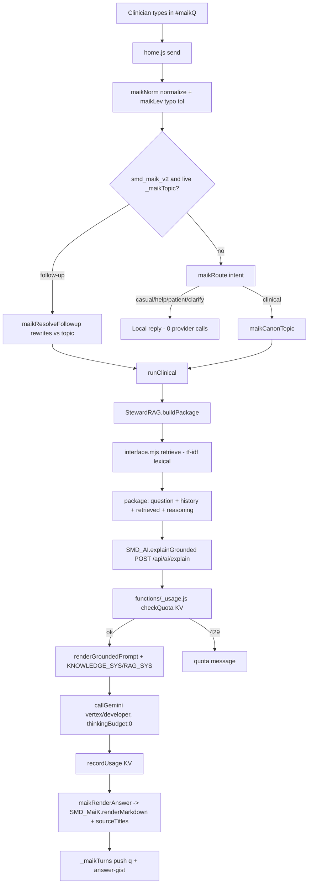

# MaiK — Current-State Audit (end-to-end pipeline)

_Phase 1 of the overnight validation mission. Documents the MaiK assistant as it exists on `main` after PRs #188 (routing), #189 (metering), #192 (topic continuity + answer planning), #193 (coverage program), #194 (conversational overhaul). No production access; source-only + local headless observation._

## 1. End-to-end flow

## 2. Components — files & functions

| Stage | File · symbol |
|---|---|
| UI composer / lifecycle | `home.js` `openAskAi()`, `send()`, `bubble()`, `#maikQ/#maikSend/#maikBody` |
| Input normalization | `home.js` `maikNorm()` (lowercase, strip punct, collapse 3+ repeats), `maikLev()` (Levenshtein ≤1 fuzzy) |
| Intent routing | `home.js` `maikRoute(q, active)` → `casual` / `help` / `patient` / `clarify` / `clinical` |
| Topic continuity | `home.js` `_maikTopic`, `maikResolveFollowup(q)`, `maikCanonTopic(q)`, flag `maikV2()` (`smd_maik_v2`, default ON) |
| Conversation memory | `home.js` `_maikTurns` (last {q, answer-gist}) → `pkg.history` |
| Package assembly | `kb/ai/steward-ai.browser.js` `buildPackage()` (derives chunks from `KB_ENRICHMENT.byId`+`KB_CORE`+`KB_RAG.treatments`) |
| Retrieval | `kb/ai/interface.mjs` `createStewardAI().retrieve()` — deterministic tf-idf, name-match dominant sort, `treatIntent` ×2.4 management boost |
| Provider seam | `reasoning.js` `SMD_AI.explainGrounded(pkg, opts)` → `POST /api/ai/explain` |
| Prompt construction | `functions/api/ai/[[path]].js` `renderGroundedPrompt()`, `KNOWLEDGE_SYS` (general) / `RAG_SYS` (active-case commentary) |
| Generation | `functions/api/ai/[[path]].js` `genBody()` (temp 0.45 general / 0.25 case, `thinkingBudget:0`, depth-aware `MAX_OUT`), `callGemini()` (vertex→developer failover) |
| Response render | `home.js` `maikRenderAnswer()`; `SMD_MaiK.renderMarkdown()`, `SMD_MaiK.sourceTitles()` (`reasoning.js`) |
| Metering / breaker | `functions/_usage.js` (`MAIK_KV`; quotas, rate limit, daily cost circuit breaker, admin) |
| Cache | `home.js` `_maikCache` (session, topic-scoped key), `_maikBusy` idempotency |

## 3. Failure modes → root cause → status

| Failure | Root cause | Status |
|---|---|---|
| Follow-up ("give in detail") lost the topic, replied "no specific question posed" + listed unrelated diseases | (a) clinician question never rendered in the prompt; (b) no topic memory → retrieval query degenerated to the phrase; (c) `treatIntent` regex included the word "give" → boosted unrelated management chunks | **Fixed** PR #192/#194 |
| Answer truncated mid-sentence | `gemini-2.5-flash` thinking tokens consumed `maxOutputTokens` | **Fixed** (thinkingBudget:0 + higher cap) PR #192 |
| Sources showed "Harrison's Principles of Internal Medicine" | hard-coded proprietary title | **Fixed** → "Standard internal-medicine reference" PR #192 |
| Rigid 8-heading template on every answer; robotic | `KNOWLEDGE_SYS` forced fixed headings at temp 0.2 | **Fixed** (adaptive prompt + temp 0.45) PR #194 |
| Symptom-only queries ("tearing chest pain to back") mis-route to a lexically-adjacent topic (GERD) | retrieval sort is disease-**name-token** dominant; symptom queries that don't name the disease under-rank the target | **Open** — retrieval limitation |
| `red_flags` / `investigations` questions retrieve the right disease but out-rank the red-flag/investigation chunk with overview/management | no capability-aware section boost for those intents | **Open** |
| Treatment-side KB coverage thin off the infective/emergency syndromes (management 28.9%, drug/dose 8.9%) | KB `drugRefs`/`recommendations` only populated for 140 diagnostic syndromes | **Open** — lawful content expansion (Phase 5) |

## 4. Risk list

- **R1 (med-safety, low):** provider could still state a dose not in the KB. Mitigated by `KNOWLEDGE_SYS` rule 3 (dose only if retrieved) — needs live-provider audit to confirm compliance.
- **R2 (retrieval, med):** name-token bias mis-routes symptom-only general questions → wrong grounding. Not user-visible in active-case mode (uses engine findings), only in general chat.
- **R3 (coverage, med):** honest gaps in non-infective management/dosing; risk is *under-answering* (transparent gap), not wrong-answering — acceptable but limits usefulness.
- **R4 (privacy, low):** `_maikTurns` holds session-only gists (not persisted, not PHI); server logs aggregate counters only (`_usage.js`). No raw prompts/PHI logged.
- **R5 (eval, med):** automated scoring cannot judge clinical prose without live-provider calls (which are out of bounds tonight) → clinical-usefulness scored by documented reviewer rubric, not automatically.

## 5. Recommended fixes — impact × effort

| # | Fix | Impact | Effort | Safe tonight? |
|---|---|---|---|---|
| 1 | Capability section-boost in `retrieve()` for red-flag / investigation / differential intents (mirror `treatIntent`) | High | Low | ✅ (retrieval only, not the clinical engine) |
| 2 | Disease alias / synonym tokens so symptom-only queries lock the right topic | High | Med | ✅ (metadata) |
| 3 | Extend intent taxonomy in `maikRoute` toward the 16-intent set (DRUG_INFORMATION, GUIDELINE_OR_PROTOCOL, CALCULATOR_REQUEST, KNOWLEDGE_GAP, UNSAFE_OR_ESCALATION) | Med | Med | ✅ |
| 4 | Lawful content expansion for Tier-1 non-infective management/dosing (Drug Index + guideline paraphrase) | High | High | ⚠️ needs authoring + clinician review (Phase 5 plan + content-request queue) |
| 5 | Live-provider answer-quality audit against the reviewer rubric | High | Med | ⚠️ requires provider calls → Owner approval |

_Order for tonight: build the eval harness → measure → then #1 (and #3 if the eval shows routing gaps), re-measure. #2/#4/#5 are queued (content authoring + provider calls need approval)._
