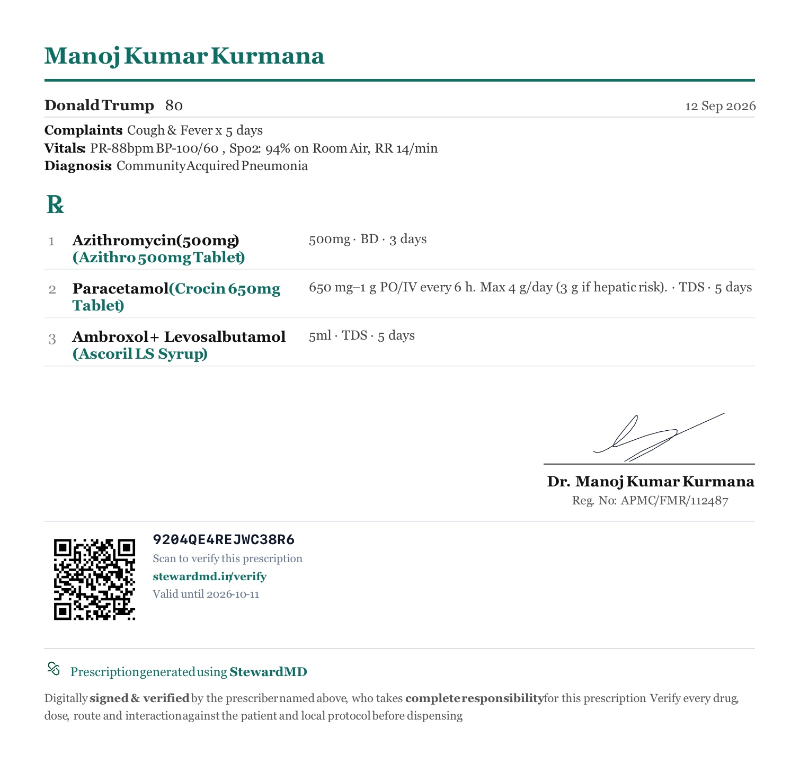
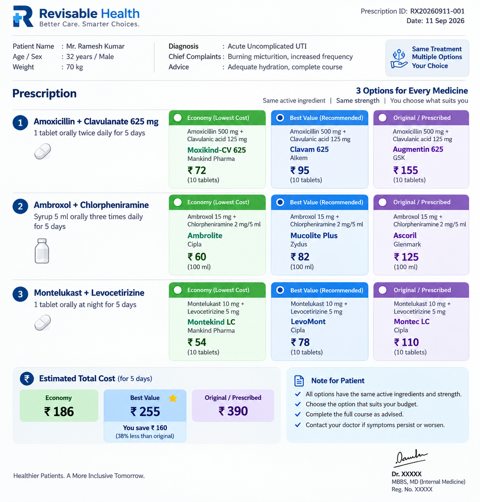
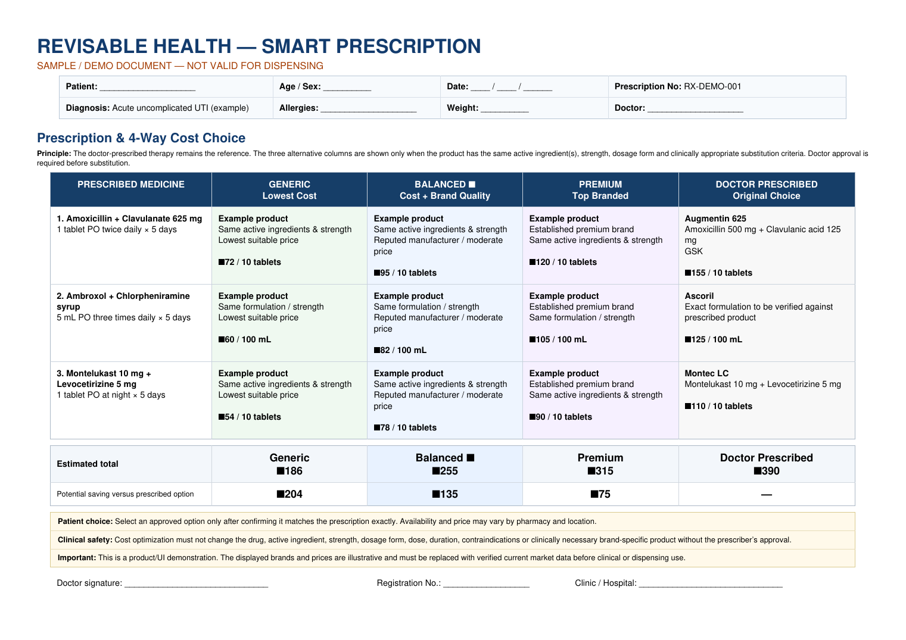

# RxChoice™ — Final Prescription UX / PDF Implementation Plan

## Product intent

**RxChoice™ — “Same Prescription. Smarter Price.”**

The normal StewardMD prescription must remain clinically conventional and authoritative. RxChoice is an additional economic-choice layer that automatically shows validated products for the exact therapy the doctor prescribed.

### Four choices — every medicine

1. **GENERIC** — Lowest Cost
2. **BALANCED ⭐** — Recommended Value
3. **PREMIUM** — Top Branded Option
4. **DOCTOR PRESCRIBED** — Original Prescription

The doctor must **not** manually populate these four categories.

> **AI interprets. Rules validate. Database supplies products/prices. Doctor decides.**

---

# 1. Reference images

## A. Current StewardMD prescription — preserve this foundation



This is the existing prescription style. The final result should retain:

- Doctor identity/header
- Patient details
- Date
- Complaints/vitals/diagnosis
- `Rx` section
- Numbered medicines
- Drug + prescribed brand
- Dose/frequency/duration
- Signature
- Registration number
- QR verification
- StewardMD footer

**Do not turn the conventional prescription into a shopping-card UI.**

---

## B. RxChoice target visual language



This image is the primary visual reference for the **choice layer**.

The important idea is:

**ONE prescription medicine → FOUR clearly separated economic choices**

The target should communicate at a glance:

| Column | Meaning |
|---|---|
| 🟢 GENERIC | Cheapest valid product |
| 🔵 BALANCED ⭐ | Best overall value |
| 🟣 PREMIUM | Established branded option |
| ⚫ DOCTOR PRESCRIBED | Exactly what doctor wrote |

The visual treatment should be refined for StewardMD's existing premium/minimal prescription design rather than copied literally.

---

## C. RxChoice PDF reference



Use this as a reference for how the four choices can be presented in a printable document.

The actual StewardMD implementation should be more restrained and clinically professional.

---

# 2. Final PDF composition

## PAGE 1 — conventional prescription first

The first part of the PDF should remain visually equivalent to the current StewardMD prescription.

Example:

```text
Dr. Manoj Kumar Kurmana
────────────────────────────────────────────

Patient: DonaldTrump        Age: 80
Date: 12 Sep 2026

Complaints: Cough & Fever × 5 days
Vitals: PR 88 bpm   BP 100/60   SpO₂ 94% RA   RR 14/min
Diagnosis: Community Acquired Pneumonia

Rx

1. Azithromycin 500 mg
   Azithro 500 mg Tablet
   500 mg BD × 3 days

2. Paracetamol 650 mg
   Crocin 650 mg Tablet
   650 mg TDS × 5 days

3. Ambroxol + Levosalbutamol
   Ascoril LS Syrup
   5 mL TDS × 5 days

                              Dr. Manoj Kumar Kurmana
                              Reg. No: ...
```

### Critical rule

**This section must NOT be rewritten into Generic/Balanced/Premium language.**

It is the legal/clinical prescription.

---

# 3. RxChoice section

Immediately below the conventional prescription, add a visually distinct section:

```text
RxChoice™
Same Prescription. Smarter Price.

Validated alternatives from the StewardMD Drug Database
Same active ingredients · Same strength · Same dosage form

┌──────────────────────────────────────────────────────────────┐
│ 1  AZITHROMYCIN 500 mg                                       │
│    Azithro 500 mg Tablet · 500 mg BD × 3 days                │
│                                                              │
│  GENERIC             BALANCED ⭐         PREMIUM              │
│  Cheapest            Recommended        Top Branded          │
│  Brand               Brand               Brand               │
│  ₹XX/course          ₹XX/course         ₹XX/course           │
│                                                              │
│                    DOCTOR PRESCRIBED                         │
│                    Azithro 500 mg Tablet                     │
│                    ₹XX/course                                │
└──────────────────────────────────────────────────────────────┘
```

For a desktop/browser prescription UI, four cards may be displayed horizontally.

For A4 PDF, use a compact four-column layout **only if readability remains excellent**. Otherwise use a two-by-two grid.

---

# 4. Automatic population

## Doctor workflow

The intended workflow is:

```text
Doctor writes prescription
        ↓
Drug + prescribed brand recognized
        ↓
StewardMD Drug Database lookup
        ↓
Resolve exact composition / strength / dosage form
        ↓
Fetch all valid same-therapy products
        ↓
Deterministic RxChoice engine
        ↓
GENERIC ─ BALANCED ─ PREMIUM ─ DOCTOR PRESCRIBED
        ↓
Doctor optionally selects another product
        ↓
Only BRAND field changes
        ↓
Prescription + RxChoice section exported
```

There should be **no second manual data-entry workflow**.

---

# 5. NON-NEGOTIABLE SAFETY MATCH

## Paracetamol tablet must never become syrup

This is the highest-priority regression.

For:

```text
Paracetamol
Crocin 650 mg Tablet
650 mg TDS
```

RxChoice may only return products that satisfy:

```text
Same active ingredient
+
Same strength
+
Same dosage form
+
Same release characteristics
+
Valid Drug Database product
```

Therefore:

```text
Paracetamol 650 mg Tablet  → VALID
Paracetamol 650 mg Caplet  → VALID only if database/core treats it as
                              the same permitted solid oral formulation

Paracetamol Syrup           → INVALID
Paracetamol Suspension      → INVALID
Paracetamol drops           → INVALID
```

And conversely:

```text
Paracetamol Syrup → must NEVER suggest a tablet.
```

**Price must never override formulation matching.**

---

# 6. Combination medicines

For:

```text
Amoxicillin 500 mg
+
Clavulanic acid 125 mg
```

a candidate is eligible only if it contains the complete required combination at the required strength.

Reject:

```text
Amoxicillin alone
Clavulanate alone
Amoxicillin 500 + clavulanate 62.5
Amoxicillin 250 + clavulanate 125
Different dosage form
Different release formulation
```

This must be deterministic.

---

# 7. Price calculation

Never display only pack MRP as the economic comparison.

Calculate:

```text
required units
÷
units per pack
=
packs required

packs required × pack MRP
=
course cost
```

Example:

```text
1 tablet BD × 5 days
= 10 tablets required

Pack = 10 tablets
MRP = ₹72

Course cost = ₹72
```

If the pack is 6 tablets:

```text
10 tablets required
→ 2 packs
→ 12 tablets dispensed

Course cost = 2 × pack MRP
```

Display:

```text
₹144 / course
```

not simply:

```text
₹72 / pack
```

---

# 8. Category rules

## GENERIC

The lowest-cost **eligible** database product.

```text
minimum eligible courseCost
```

Tie-break:

```text
deterministic brand ordering
```

---

## BALANCED ⭐

This is **not simply the second-cheapest product**.

It should be the highest deterministic value score using factors such as:

```text
price efficiency
manufacturer/value signal
pack fit
exact match confidence
```

Suggested current weighting:

```text
Price          55%
Manufacturer   30%
Pack fit       15%
```

Weights must remain configurable.

Label:

**BALANCED ⭐ · RECOMMENDED VALUE**

Never imply that Balanced is clinically superior.

---

## PREMIUM

The highest manufacturer-tier branded option among eligible products.

Price is only a tie-breaker within the premium tier.

Do not say:

```text
Clinically better
Safer
More effective
```

unless the database contains a validated clinical reason.

Use:

**PREMIUM · TOP BRANDED OPTION**

---

## DOCTOR PRESCRIBED

Always display the original product.

It must survive:

- no alternatives
- unavailable MRP
- blocked medicine
- incomplete database result
- restricted formulation

This is the doctor's original choice.

---

# 9. No silent substitution

Clicking:

```text
GENERIC
BALANCED
PREMIUM
```

may change only:

```text
[data-f="brand"]
```

It must NOT modify:

```text
drug
dose
frequency
duration
route
```

After selection:

```text
refreshSafety()
```

must run using the newly selected product.

---

# 10. Restricted medicines

Use conservative handling for:

- MR / XR / CR / SR / ER formulations
- Narrow therapeutic index drugs
- Biologics
- Insulins
- Complex inhalers
- Transdermal systems
- Specialized formulations

Do not expose an apparently interchangeable alternative unless equivalence is provable from the Drug Database and deterministic rules.

When uncertain:

```text
DOCTOR PRESCRIBED
```

remains available and alternatives can be withheld.

---

# 11. Prescription UI

## Inline automatic cards

The doctor should see a compact RxChoice block directly associated with each medicine after the database resolves it.

Example:

```text
2  Paracetamol 650 mg
   Crocin 650 mg Tablet
   650 mg · TDS · 5 days

   RxChoice™                         Validated ✓

   ┌────────────┐ ┌────────────┐
   │ GENERIC    │ │ BALANCED ⭐│
   │ Brand A    │ │ Brand B    │
   │ ₹XX/course │ │ ₹XX/course │
   └────────────┘ └────────────┘

   ┌────────────┐ ┌────────────┐
   │ PREMIUM    │ │ DOCTOR     │
   │ Brand C    │ │ PRESCRIBED │
   │ ₹XX/course │ │ Crocin     │
   └────────────┘ └────────────┘
```

### Do not

- automatically replace the doctor's brand
- hide the original brand
- require opening another screen to discover alternatives
- mix dosage forms
- show unverified brands
- invent prices

---

# 12. Empty / unresolved states

If a brand cannot be resolved:

```text
RxChoice™

Unable to verify this medicine against the Drug Database.
The original prescription is unchanged.
```

Do NOT guess.

If no eligible alternatives exist:

```text
RxChoice™

No validated alternative found for this exact
ingredient + strength + dosage form.

DOCTOR PRESCRIBED
[original product]
```

---

# 13. PDF footer / disclaimer

Use restrained language:

```text
RxChoice™ compares eligible products in the StewardMD Drug Database.

Prices are calculated from database MRP and pack size and represent
an estimated course cost, not a live pharmacy quotation.

RxChoice does not change the prescribed therapy.
Final product selection remains the doctor's decision.
```

Avoid consumer-shopping language.

---

# 14. Audit trail

For every actual selection record:

```js
{
  originalProduct,
  alternativeProduct,
  category,
  reasonShown,
  priceAtTime,
  courseCostAtTime,
  doctorApproved,
  timestamp
}
```

The original prescription should remain reconstructable.

---

# 15. Existing StewardMD architecture to preserve

The current repository already has the correct conceptual separation:

```text
rxchoice-flags.js
        ↓
rxchoice-core.js
        ↓
rxchoice-ui.js
        ↓
prescription.js
        ↓
PDF / print
```

The core principle should remain:

```text
MEDAPI / Drug Database
        ↓
rxchoice-core
        ↓
validated candidates
        ↓
UI
```

Do not create another independent brand database.

---

# 16. Implementation tasks

## Phase A — core correctness

- [ ] Verify canonical dosage-form normalization
- [ ] Verify tablet ≠ syrup
- [ ] Verify release formulation matching
- [ ] Verify complete combination matching
- [ ] Verify exact strength matching
- [ ] Verify discontinued products are excluded
- [ ] Verify Doctor Prescribed always survives
- [ ] Verify course-cost calculation

## Phase B — automatic UI

- [ ] Automatically detect completed prescription rows
- [ ] Resolve prescribed brand from MEDAPI
- [ ] Fetch same-composition products
- [ ] Automatically populate all four cards
- [ ] Refresh when brand/drug/dose/form changes
- [ ] Debounce database requests
- [ ] Avoid stale results when doctor edits a line
- [ ] Keep unresolved lines safe

## Phase C — selection

- [ ] Generic click → brand only
- [ ] Balanced click → brand only
- [ ] Premium click → brand only
- [ ] Doctor Prescribed click → restore original brand
- [ ] Re-run safety checks after selection
- [ ] Record audit event

## Phase D — PDF

- [ ] Preserve conventional prescription unchanged
- [ ] Add RxChoice section beneath it
- [ ] Show four categories for each eligible medicine
- [ ] Show course cost
- [ ] Show selected/final product
- [ ] Keep PDF readable at A4
- [ ] Do not split a medicine's RxChoice block awkwardly across pages
- [ ] Verify QR/signature remain intact

## Phase E — regression testing

Mandatory tests:

```text
Paracetamol Tablet ≠ Paracetamol Syrup
Paracetamol Syrup ≠ Paracetamol Tablet
625 mg ≠ 375 mg
Tablet ≠ Syrup
Single ingredient ≠ combination
Active product ≠ discontinued product
10 tablets required + 6/tablet pack = 2 packs
Doctor Prescribed always present
Balanced independent of candidate ordering
Selection changes only brand
```

---

# 17. Browser acceptance test

The browser test must prove the actual rendered experience, not just inspect source code.

### Test case

Create:

```text
Paracetamol
Crocin 650 mg Tablet
650 mg
TDS
5 days
```

Expected:

```text
RxChoice™ visible automatically

GENERIC      → valid tablet
BALANCED     → valid tablet
PREMIUM      → valid tablet
DOCTOR       → Crocin 650 mg Tablet
```

And assert:

```text
No "Syrup" candidate appears anywhere.
```

Then create:

```text
Paracetamol Syrup
```

and assert:

```text
No tablet candidate appears.
```

---

# 18. Final visual target

The finished StewardMD prescription should feel like:

**Clinical prescription first. Intelligent economic choice second.**

Not:

**Shopping interface disguised as a prescription.**

The visual hierarchy should therefore be:

```text
┌──────────────────────────────────────────┐
│ STEWARDMD / DOCTOR                       │
│ Patient / diagnosis / date               │
├──────────────────────────────────────────┤
│ Rx                                       │
│                                          │
│ 1. Medicine + original brand             │
│    dose / frequency / duration            │
│                                          │
│ 2. Medicine + original brand             │
│    dose / frequency / duration            │
│                                          │
│ 3. Medicine + original brand             │
│    dose / frequency / duration            │
│                                          │
│ Signature / QR / verification             │
├──────────────────────────────────────────┤
│ RxChoice™                                │
│ Same Prescription. Smarter Price.        │
│                                          │
│ Medicine 1                               │
│ ┌────────┬────────┬────────┬───────────┐ │
│ │GENERIC │BALANCED│PREMIUM │DOCTOR     │ │
│ └────────┴────────┴────────┴───────────┘ │
│                                          │
│ Medicine 2                               │
│ ┌────────┬────────┬────────┬───────────┐ │
│ │GENERIC │BALANCED│PREMIUM │DOCTOR     │ │
│ └────────┴────────┴────────┴───────────┘ │
│                                          │
│ Estimated course cost                    │
│ RxChoice disclaimer                      │
└──────────────────────────────────────────┘
```

---

# 19. Definition of done

RxChoice is considered complete only when all of these are true:

- [ ] Four categories populate automatically
- [ ] Products come exclusively from StewardMD Drug Database
- [ ] No guessed/generated brands
- [ ] No guessed/generated prices
- [ ] Exact ingredient matching
- [ ] Exact strength matching
- [ ] Exact dosage-form matching
- [ ] Release characteristics respected
- [ ] Paracetamol tablet never maps to syrup
- [ ] Combination products require complete combination
- [ ] Course cost uses pack size
- [ ] Generic = lowest valid course cost
- [ ] Balanced = deterministic value ranking
- [ ] Premium = top branded tier
- [ ] Doctor Prescribed = always retained
- [ ] No silent substitution
- [ ] Selection modifies only brand
- [ ] Audit trail retained
- [ ] Conventional prescription remains intact
- [ ] RxChoice appears in the exported PDF
- [ ] PDF is readable and professionally branded
- [ ] Browser regression tests pass
- [ ] iOS/native build receives the same files
- [ ] Service-worker caching cannot leave the device running an old RxChoice bundle

---

## Core product principle

> **Same Prescription. Smarter Price.**
>
> Same therapy. Same strength. Same formulation.
>
> The only thing RxChoice changes is the economic choice of product —
> and only after the doctor decides.
