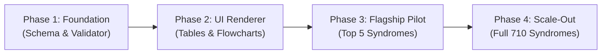

# StewardMD Knowledge Base — Blueprint to 5/5 Best-in-Class

> **Goal**: Elevate the StewardMD syndrome and clinical knowledge base from high-yield text summaries to a definitive, world-class bedside clinical reference that outperforms UpToDate, Amboss, and the Oxford Handbooks in speed, visual clarity, and bedside utility.

---

## 1. Executive Vision: The "5/5" Standard

A medical reference achieves a true **5/5** when a clinician in a resuscitation bay, ward, or clinic can answer any of the following within **5 seconds**:
1. **The Diagnostic Branch**: *"What does my patient have, and what is the exact next test?"* (Visual flowchart + interactive score).
2. **The Immediate Action**: *"What drug, at what dose, adjusted for what renal function?"* (Actionable drug card + subgroup dosing).
3. **The Confuser Check**: *"How do I know this isn't the primary mimicker?"* (High-contrast comparison table).
4. **The Visual Gestalt**: *"What does the physical exam sign or imaging look like?"* (Clinical visual/schematic).

```
   Current (4.7/5)                      Target (5.0/5 Gold Standard)
┌───────────────────────┐            ┌───────────────────────────────────────────────┐
│ • Bulleted text       │            │  Interactive Flowcharts (Mermaid/SVG)        │
│ • Prose criteria      │            │  Side-by-Side Comparison & Grading Tables    │
│ • General drug doses  │   ───────► │  Embedded Calculators (ADD-RS, Cairo-Bishop) │
│ • Text pearls         │            │  Renal/Hepatic/Pregnancy Stratification       │
│ • Static references   │            │  Diagnostic Metrics (Sens/Spec, +LR/-LR)      │
└───────────────────────┘            │  High-Yield Clinical Visuals & Radiographs    │
                                     │  Active Bi-directional Knowledge Graph Links  │
                                     └───────────────────────────────────────────────┘
```

---

## 2. Architecture & Schema Enhancements

### 2.1 Schema Expansion (`kb/clinical-protocols/` and `kb/reference/`)

We update the validator (`scripts/build-clinical-protocols.mjs`) to allow rich structural fields while keeping strict validation:

```typescript
interface ProtocolSchemaV2 {
  // Existing core fields
  id: string;
  title: string;
  subject: SubjectKey;
  population: PopulationKey;
  basis: "international" | "india";
  counterpart?: string;
  setting?: string;
  aliases: string[];
  summary: string;
  sections: Section[];
  drugs: Drug[];
  sources: Source[];
  review: ReviewMeta;

  // NEW 5/5 POWER BLOCKS:
  algorithms?: Array<{
    id: string;
    title: string;
    type: "flowchart" | "decision_tree";
    syntax: "mermaid";
    code: string; // e.g. "graph TD\n A[Chest Pain] --> B{ADD-RS} ..."
    caption?: string;
  }>;

  tables?: Array<{
    id: string;
    title: string;
    description?: string;
    headers: string[];
    rows: Array<string[]>;
    highlightColumn?: number;
  }>;

  calculators?: Array<{
    id: string; // matches id in calc-links.js / calculators.js
    title: string;
    triggerContext: string; // e.g. "When determining pre-test probability"
  }>;

  visuals?: Array<{
    id: string;
    title: string;
    type: "photo" | "radiology" | "ecg" | "diagram";
    assetUrl: string; // local or CDN asset
    caption: string;
    findings: string[]; // key bullet callouts pointing to findings
  }>;

  subgroupAdjustments?: {
    renal?: Array<{ crcl: string; guidance: string }>;
    hepatic?: Array<{ tier: string; guidance: string }>;
    pregnancy?: { category: string; firstLine: string; contraindicated: string[] };
    elderly?: string[];
  };

  crossLinks?: Array<{
    id: string;
    type: "protocol" | "reference" | "calculator" | "drug";
    label: string;
    relationship: "differential" | "complication" | "underlying_cause" | "workup";
  }>;
}
```

---

## 3. The 6 Implementation Pillars

### Pillar 1: Diagnostic & Management Flowcharts (Dx / Mx Decision Trees)
- **Engine**: Client-side **Mermaid.js** or light custom SVG tree renderer embedded in `kb-protocols.js`.
- **Bedside Benefit**: Rather than reading 4 paragraphs of text under `immediate` and `investigations`, the clinician sees:
  ```mermaid
  graph TD
      A["Severe Tearing Chest / Back Pain"] --> B["Assess Hemodynamic Stability"]
      B -->|"Unstable (Shock / Tamponade)"| C["Bedside TTE in Resus / Theatre"]
      C --> D["Emergency Sternotomy / Thoracotomy"]
      B -->|"Stable"| E["ADD-RS Risk Score"]
      E -->|"ADD-RS 0-1 (Low/Int)"| F["Check D-Dimer"]
      F -->|"< 500 ng/mL"| G["AAS Unlikely — Seek Alternative Dx"]
      F -->|">= 500 ng/mL"| H["Urgent Triple-Rule-Out CTA Whole Aorta"]
      E -->|"ADD-RS 2-3 (High)"| H
      H -->|"Type A (Ascending)"| I["Immediate Cardiothoracic Surgery + Impulse Control"]
      H -->|"Type B (Descending)"| J["Medical Impulse Control (HR < 60, SBP 100-120)"]
      J -->|"Complicated (Malperfusion/Rupture)"| K["TEVAR"]
      J -->|"Uncomplicated"| L["ICU Monitoring + Medical Mx"]
  ```

### Pillar 2: High-Contrast Comparison Tables
- **Use Case**: Eliminating diagnostic ambiguity between lookalike syndromes.
- **Example**: Under both `serotonin-syndrome.json` and `neuroleptic-malignant-syndrome.json`, embed a comparative table:

| Diagnostic Feature | Serotonin Syndrome (SS) | Neuroleptic Malignant Syndrome (NMS) | Malignant Hyperthermia (MH) |
|---|---|---|---|
| **Etiology** | Serotonergic agents (SSRIs, SNRIs, MAOIs, Tramadol) | Dopamine antagonists (Antipsychotics, Metoclopramide) | Volatile anesthetics, Succinylcholine |
| **Onset** | **Rapid** (minutes to 24 hours) | **Insidious** (days to 1–2 weeks) | **Hyperacute** (minutes to hours in OR) |
| **Neuromuscular** | **Hyperreflexia, clonus, tremor** (lower > upper) | **"Lead-pipe" rigidity**, bradyreflexia | Generalized extreme rigidity |
| **Pupils** | **Mydriasis** common | Usually normal | Normal / Dilated |
| **Bowel Sounds** | **Hyperactive**, diarrhea, borborygmi | Normal or **hypoactive** | Hypoactive |
| **Key Antidote** | Cyproheptadine, Benzodiazepines | Dantrolene, Bromocriptine | Dantrolene immediately |

### Pillar 3: Live Embedded Calculator Widgets
- Connect `calc-links.js` with `kb-protocols.js`.
- If a protocol specifies `ADD-RS`, `Cairo-Bishop`, `Wells PE`, `CURB-65`, or `Glasgow-Blatchford`, render an **interactive inline scoring card**:
  - Tapping checkboxes updates the score live.
  - Automatically activates the corresponding pathway in the flowchart.

### Pillar 4: Diagnostic Metrics (+LR / -LR, Sensitivity & Specificity)
- Replace generic statements like *"Pain on passive stretch is a sign"* with high-confidence quantitative anchors:
  - `Passive stretch pain`: **Sensitivity 90%** (earliest reliable clinical sign).
  - `Palpable tense compartment`: **Specificity 97%** (+LR: 4.8).
  - `Loss of pulses & pallor`: **Late finding indicating irreversible myonecrosis** (-LR not useful for early rule-out).

### Pillar 5: Subgroup Dosing Tiers (Renal, Hepatic, Pregnancy, Pediatric)
- Ensure every drug entry in `drugs: []` has explicit safety boundaries:
  - `Rasburicase`: Contraindicated in G6PD deficiency (risk of severe hemolysis/methemoglobinemia).
  - `Esmolol / Labetalol`: Titration guidance in renal failure vs acute bronchospasm.
  - `CT Angiography vs MRI vs TEE in Pregnancy`: Safety protocols regarding contrast vs radiation vs emergency surgical triage.

### Pillar 6: Clinical Visuals & Pathology / Radiology Anchors
- Integrate image carousels or diagnostic thumbnails:
  - **Radiology**: Contrast CT of aortic dissection (true lumen vs false lumen vs intimal flap), Rigler's triad in Bouveret, "snowball" lesions on brain MRI in Susac.
  - **Dermatology / Dysmorphology**: Characteristic facies in Angelman, Apert, Williams, Treacher Collins; rash patterns in DRESS and Sweet syndrome.
  - **ECGs**: Delta wave & short PR in Wolff-Parkinson-White, S1Q3T3 and sinus tachycardia in PE.

---

## 4. Phased Execution Roadmap



### Phase 1: Schema & Build Infrastructure
1. **Extend `scripts/build-clinical-protocols.mjs`**:
   - Update `TOP_KEYS` to validate optional `algorithms`, `tables`, `calculators`, `visuals`, and `subgroupAdjustments`.
   - Ensure `npm test` and `test/kb-clinical-protocols.test.mjs` pass cleanly.
2. **Harmonize Reference Schema**:
   - Verify all 700 reference entries adhere to the unified `reference` structure with zero legacy key drift.

### Phase 2: UI Engine Enhancements (`kb-protocols.js` & CSS)
1. **Tables Component**:
   - Implement clean HTML `<table>` rendering with CSS sticky headers, zebra stripes, and mobile horizontal scrolling.
2. **Flowchart Renderer**:
   - Integrate lightweight Mermaid / SVG tree rendering for decision algorithms.
3. **Interactive Calculator Integration**:
   - Embed inline calculator chips that launch the relevant calculator from `calculators.js`.

### Phase 3: Flagship 5/5 Pilot (Top Acute Syndromes)
Upgrade the 5 most critical acute syndromes to the full 5/5 standard:
- 🫀 **Acute Aortic Syndrome**: ADD-RS + D-dimer flowchart, Type A vs Type B comparison, impulse control titration table.
- ⚡ **Serotonin Syndrome**: Hunter criteria decision tree, side-by-side SS vs NMS vs MH differential table, cyproheptadine dosing.
- 🩸 **Tumour Lysis Syndrome**: Cairo-Bishop diagnostic grid, hydration + rasburicase/allopurinol stratification, G6PD red flags.
- 🧠 **Neuroleptic Malignant Syndrome**: Diagnostic criteria, dantrolene/bromocriptine protocols, ECT indications.
- 🦵 **Acute Compartment Syndrome**: Delta pressure (ΔP ≤ 30 mmHg) calculator, clinical sign sensitivity/specificity table, emergency bedside release steps.

### Phase 4: Full KB Scale-Out & Automation
- Systematically enrich the remaining 5 clinical protocols and high-yield reference syndromes.
- Add visual image mappings and cross-links across the entire knowledge graph.

---

## 5. Verification & Quality Gates

Every upgraded entry must pass the **5-Point Gold Standard Checklist**:
- [ ] **Flowchart Check**: Does it have an explicit visual diagnostic/management pathway?
- [ ] **Differential Table**: Is there a side-by-side contrast table against top mimickers?
- [ ] **Quantitative Anchors**: Are diagnostic criteria stated with sensitivity/specificity or explicit point thresholds?
- [ ] **Safety Adjustments**: Are renal, pregnancy, and drug contraindications clearly highlighted?
- [ ] **Schema & Test Compliance**: Does `npm test` pass with 0 errors and 0 content drift?
